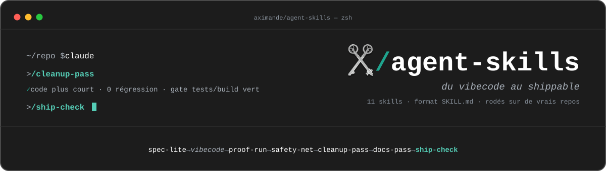

<p align="center">
  
</p>

<div align="center">

**Des skills rodés, pas des prompts.**

[](https://agentskills.io)


[](LICENSE)

**[Première fois avec un agent IA ? Le guide pas à pas →](https://aximande.github.io/agent-skills/guide.html)**

</div>

Onze skills au format ouvert [SKILL.md](https://agentskills.io) pour faire
passer un projet vibecodé, qui « marche sur ma machine », au stade
publiable. Ils marchent avec Claude Code, Codex CLI, Cursor et tout outil
compatible.

Chaque skill est mesuré sur un vrai repo avant publication : on sabote le
code pour vérifier qu'il détecte, et les leçons du terrain sont réécrites
dedans. Je les ai écrits pour mon propre workflow et je les partage tels
quels : prenez, adaptez, faites-en les vôtres.

## La philosophie

Le moteur vient d'Andrej Karpathy. Il a nommé le *vibe coding* (coder en
acceptant ce que le modèle propose) et documenté ses pièges : les modèles
font des assomptions silencieuses, sur-compliquent, gonflent les
abstractions et touchent du code qu'ils ne comprennent pas. Les
[4 principes](https://github.com/multica-ai/andrej-karpathy-skills) qui en
découlent sont le socle de chaque skill : réfléchir avant de coder, la
simplicité d'abord, des changements chirurgicaux, une exécution guidée
par des critères vérifiables. Leur traduction ici : toute passe est gatée
par les tests et le build du repo cible, et ce qui ne peut pas être
prouvé part en rapport, pas en commit.

## Installer

```bash
git clone https://github.com/Aximande/agent-skills.git
cd agent-skills && ./install.sh
```

Un seul exemplaire des skills, relié à Claude Code, Codex CLI et Cursor.
`git pull` dans le dossier suffit pour tout mettre à jour.

| Outil | Comment |
|---|---|
| Claude Code | Après `install.sh` : tapez `/cleanup-pass`, ou dites « nettoie ce repo » |
| Codex CLI | Après `install.sh` : le skill se charge seul quand la demande correspond |
| Cursor | Après `install.sh` : tapez `/cleanup-pass` dans le chat |
| Claude (app, claude.ai) | Zippez `skills/<nom>/`, importez-le dans Réglages → Skills → Add → Upload skill |
| Sans cloner | `npx skills add Aximande/agent-skills` copie les skills choisis dans votre projet |
| ChatGPT, Gemini, autre chat | Collez le SKILL.md avec « Lis ce document et exécute-le exactement comme prescrit » |

## Le pipeline

Du vibecode au shippable, chaque étape ne passe la main que sur une preuve.

```text
spec-lite → vibecode → proof-run → safety-net → cleanup-pass → docs-pass → ship-check

avant cleanup-pass, selon le projet :
  + react-doctor   si le repo est en React ou Next
  + fluid-pass     si le produit a une interface
```

*vibecode* n'est pas un skill : c'est vous.

## Les skills (quand utiliser lequel)

**Cadrer et prouver**, avant et juste après avoir codé

| Skill | À utiliser quand… |
|---|---|
| [`spec-lite`](skills/spec-lite/SKILL.md) | Vous allez vibecoder une feature : une page de critères observables, que proof-run exécutera tels quels. |
| [`proof-run`](skills/proof-run/SKILL.md) | Vous voulez prouver que la feature marche : un vérificateur indépendant pilote la vraie app et joint la preuve à la PR. |

**Assainir**, quand le repo marche mais que personne n'ose y toucher

| Skill | À utiliser quand… |
|---|---|
| [`safety-net`](skills/safety-net/SKILL.md) | Le repo n'a pas de tests : un filet de tests de caractérisation, prouvé par sabotage. |
| [`react-doctor`](skills/react-doctor/SKILL.md) | C'est un repo React ou Next : le lint des hooks posé, et ce que le lint ne voit pas, prouvé au fichier et à la ligne. |
| [`fluid-pass`](skills/fluid-pass/SKILL.md) | Vos drags, sheets, carousels ou animations web n'ont pas le feel natif : réponse à l'appui, gestes 1:1, animations interruptibles, reduced-motion, latences mesurées dans la vraie app. |
| [`cleanup-pass`](skills/cleanup-pass/SKILL.md) | Vous voulez un code plus court sans changer son comportement, chaque commit gaté par vos tests. |

**Publier**, avant de partager ou de déployer

| Skill | À utiliser quand… |
|---|---|
| [`docs-pass`](skills/docs-pass/SKILL.md) | Le README doit être juste : chaque commande est réellement exécutée, le contexte agent (CLAUDE.md) audité. |
| [`ship-check`](skills/ship-check/SKILL.md) | Vous allez passer le repo en public ou le déployer : secrets, dépendances, RLS, surface applicative, verdict GO/NO-GO. |

**Au quotidien**, en dehors du pipeline

| Skill | À utiliser quand… |
|---|---|
| [`doc-ingest`](skills/doc-ingest/SKILL.md) | Un PDF, un Word ou un Excel doit entrer dans le contexte de l'agent, en markdown propre. |
| [`llm-handover`](skills/llm-handover/SKILL.md) | Vous passez la main à un autre agent : état, décisions et prochaine action, vérifiés par un agent frais. |
| [`excalidraw-slides`](skills/excalidraw-slides/SKILL.md) | Il vous faut une présentation Excalidraw éditable, avec notes orales et contrôle visuel. |

## Prérequis

- Un terminal et `git`. C'est tout pour installer.
- `proof-run`, `fluid-pass` et `react-doctor` pilotent la vraie app ; pour le web, avec [agent-browser](https://github.com/vercel-labs/agent-browser).
- `ship-check` scanne les secrets avec [gitleaks](https://github.com/gitleaks/gitleaks) (`brew install gitleaks`).
- `doc-ingest` convertit avec markitdown, lancé par `uvx` (il faut [uv](https://docs.astral.sh/uv/)) ;
  en option, `rendergit` aplatit un repo entier en une page
  (`uv tool install git+https://github.com/karpathy/rendergit`).
- `react-doctor` et `fluid-pass` rechargent la doc du jour via le MCP
  [Context7](https://github.com/upstash/context7) avant tout diagnostic.
- `excalidraw-slides` crée et modifie les scènes via le connecteur MCP
  Excalidraw+ ; sans lui, il produit un fichier `.excalidraw` à importer
  à la main dans [excalidraw.com](https://excalidraw.com).

## Organisation du dépôt

```text
agent-skills/
├── install.sh            relie les skills à Claude Code, Codex CLI et Cursor
├── skills/<nom>/
│   └── SKILL.md          le skill, en markdown autoporteur
├── docs/index.html       le guide pas à pas (aximande.github.io/agent-skills)
└── ROADMAP.md            la méthode et les inspirations créditées
```

## Pourquoi « rodés »

Chaque skill naît d'une session de grilling, arrive
avec son protocole de mesure écrit avant le premier essai, puis se rode sur un
vrai repo où l'on injecte des défauts connus. Chaque défaut observé devient une
ligne du skill. Les inspirations sont créditées dans la [ROADMAP](ROADMAP.md).

## Licence

[MIT](LICENSE). Le socle conceptuel hérite d'andrej-karpathy-skills (MIT).
