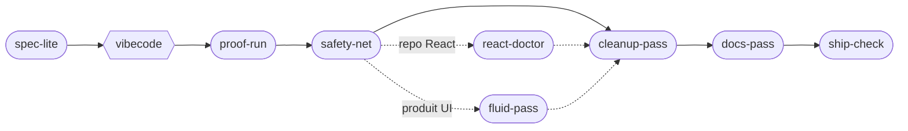

<p align="center">
  
</p>

<div align="center">

**Des skills rodés, pas des prompts.**

Chaque skill est mesuré sur un vrai repo avant publication : on sabote le code
pour vérifier qu'il détecte, et les leçons du terrain sont réécrites dans le skill.

*(Battle-tested agent skills in the open [SKILL.md](https://agentskills.io) format,
for Claude Code, Codex CLI, Cursor and any compatible tool.)*

Des skills pensés pour mon propre workflow avant tout, partagés tels
quels : prenez, adaptez, faites-en les vôtres.

<br/>

[](https://agentskills.io)


[](LICENSE)

**[Guide visuel & installation pas-à-pas →](https://aximande.github.io/agent-skills/)**

</div>

---

## La philosophie

Le moteur vient d'Andrej Karpathy. Il a nommé le *vibe coding* (coder en
acceptant ce que le modèle propose) et documenté ses pièges : les modèles
font des assomptions silencieuses, sur-compliquent, gonflent les
abstractions et touchent du code qu'ils ne comprennent pas. Les
[4 principes](https://github.com/multica-ai/andrej-karpathy-skills) qui en
découlent sont le socle de chaque skill : réfléchir avant de coder, la
simplicité d'abord, des changements chirurgicaux, une exécution guidée
par des critères vérifiables. Leur traduction opérationnelle ici : toute
passe est gatée par les tests et le build du repo cible, et ce qui ne
peut pas être prouvé part en rapport, pas en commit.

## Le pipeline

Partir d'un repo vibecodé qui « marche sur ma machine » et le rendre shippable,
chaque étape gatée par une preuve. (*vibecode* n'est pas un skill : c'est vous.)



| Skill | Rôle |
|---|---|
| [`spec-lite`](skills/spec-lite/SKILL.md) | Une page de critères d'acceptation avant de vibecoder : observables, exécutables tels quels par proof-run |
| [`proof-run`](skills/proof-run/SKILL.md) | Un vérificateur indépendant pilote la vraie app et embarque la preuve dans la PR |
| [`safety-net`](skills/safety-net/SKILL.md) | Tests de caractérisation sur un repo non testé, prouvés par sabotage |
| [`react-doctor`](skills/react-doctor/SKILL.md) | Diagnostic React/Next : pose le lint hooks, audite ce que le lint ne voit pas |
| [`fluid-pass`](skills/fluid-pass/SKILL.md) | Repasse « feel » à la Apple : gestes 1:1, springs interruptibles, latences mesurées dans la vraie app ; mode amélioration anti-template |
| [`cleanup-pass`](skills/cleanup-pass/SKILL.md) | Code plus court à comportement constant, gaté par les tests du repo |
| [`docs-pass`](skills/docs-pass/SKILL.md) | Un README dont chaque commande a réellement été exécutée |
| [`ship-check`](skills/ship-check/SKILL.md) | Audit pré-publication : secrets, dépendances, RLS, surface applicative |

En dehors du pipeline, trois skills transverses :

| Skill | Rôle |
|---|---|
| [`doc-ingest`](skills/doc-ingest/SKILL.md) | PDF et documents Office convertis en markdown pour le contexte agent |
| [`llm-handover`](skills/llm-handover/SKILL.md) | Handover vers un autre LLM, vérifié par un agent frais qui ne voit que le document |
| [`excalidraw-slides`](skills/excalidraw-slides/SKILL.md) | Présentations Excalidraw éditables, avec notes orales et contrôle visuel |

## Installation

```bash
git clone https://github.com/Aximande/agent-skills.git
cd agent-skills && ./install.sh
```

`install.sh` symlinke les skills vers les emplacements standards : un seul
exemplaire, mis à jour par `git pull` (`--copy` pour copier au lieu de symlinker).
Seuls prérequis : un terminal et git. Première fois avec un agent IA ? Le
[guide visuel](https://aximande.github.io/agent-skills/#install) reprend chaque
étape outil par outil.

<details>
<summary><strong>Claude Code</strong></summary>
<br/>

Symlinks vers `~/.claude/skills/` : slash commands (`/cleanup-pass`,
`/ship-check`…) ou langage naturel (« nettoie ce repo »).

</details>

<details>
<summary><strong>Claude (app de bureau &amp; claude.ai)</strong></summary>
<br/>

Téléchargez le repo (Code → Download ZIP), compressez le dossier du skill
voulu (ex. `skills/cleanup-pass/`), puis importez le zip dans
Réglages → Fonctionnalités → Skills. Demandez ensuite en langage naturel
(« nettoie ce repo avec cleanup-pass »).

</details>

<details>
<summary><strong>Codex CLI et le standard agent-skills</strong></summary>
<br/>

Symlinks vers `~/.agents/skills/`, chargés automatiquement quand la tâche
correspond.

</details>

<details>
<summary><strong>Cursor</strong></summary>
<br/>

Commandes générées dans `~/.cursor/commands/`, pointant vers le SKILL.md du clone.

</details>

<details>
<summary><strong>Sans cloner</strong></summary>
<br/>

```bash
npx skills add Aximande/agent-skills
```

Copie les skills choisis comme fichiers éditables dans votre projet.
`npx skills update` pour récupérer les dernières versions.

</details>

<details>
<summary><strong>ChatGPT et tout autre chat (Gemini, Le Chat…)</strong></summary>
<br/>

Le SKILL.md est du markdown autoporteur. Ouvrez-le sur GitHub (bouton Raw),
copiez tout, collez dans la conversation avec la consigne « Lis ce document
et exécute-le exactement comme prescrit », puis votre demande. Pour un usage
durable dans ChatGPT, ajoutez le fichier à un Projet ou un GPT personnalisé.

</details>

Pour un usage par projet plutôt que global : copiez `skills/<nom>/` dans le
`.claude/skills/` du repo, le skill voyage alors avec lui pour toute l'équipe.

## La méthode

Un skill naît d'une session de grilling : des rounds de questions serrées
jusqu'à ce que les décisions soient verrouillées. La v1 arrive avec son
protocole de mesure, écrit avant le premier run. Le rodage se fait sur un
vrai repo, jamais sur un exemple jouet : on y injecte des pathologies connues
pour vérifier que le skill les attrape, et chaque défaut observé devient une
ligne du SKILL.md. Toutes les inspirations sont créditées dans la
[ROADMAP](ROADMAP.md).

## Licence

[MIT](LICENSE). Le socle conceptuel hérite d'andrej-karpathy-skills (MIT).
